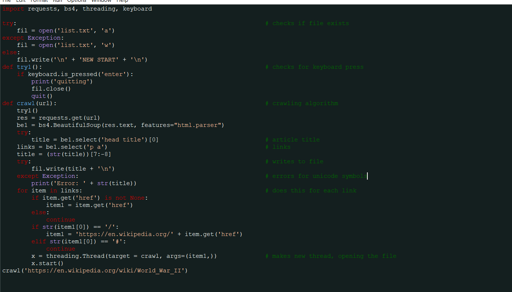

# Dark IDLE Theme
A dark theme created for Python's built in IDE, IDLE, that has a similar color palette to Monokai, but has colors that are easier on the eyes and more visible and a red highlight for errors.

<b>Dark theme in IDLE. Similar to Monokai, but with softer colors.</b>

<b>To install this on Windows 10</b>, go to "C:\Users\(username goes here)\.idlerc" and paste the config_main and config_highlight files here. Then, open the IDLE shell and, under the "Options" toolbar, open "Configure IDLE" and click on the "Highlights" tab. Select the "dark_theme" option and click Apply. This sets the theme to the dark theme unless changed back to the default theme. <b>To install on Linux,</b> go to /usr/lib/python(version_number_here) and copypaste the contents of the file "config-highlight.cfg" into "config-highlight.def" and proceed with the previous steps.
